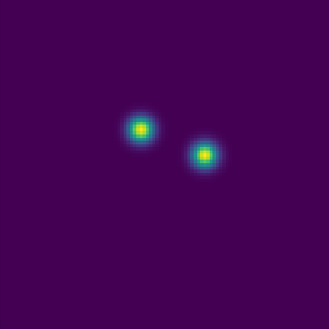

# 数据预处理

本篇是 Build Your Own Face Detection Model 的第三节。

从这一节开始，我们将会完成标注文件解析，输入数据预处理，训练标签生成三大目标。耗时较长，请给自己一点耐心哦！

### 1 >> 开始之前

由于这系列博文的目标是快速实现一个 CenterFace 模型，而不是人脸检测入门，所以我假设读者已经有一定基础。如果已经读过人脸识别系列的则更好，因为这两者的代码结构是一样的。


### 2 >> 解析标注文件

创建一个`datasets.py`文件，导入以下依赖：

```py
import os
import os.path as osp

import numpy as np
import torch
from torch.utils.data import Dataset
from PIL import Image
```

现在，我们想解析标注文件了，可以先回顾下[文件的格式](./data.md)！

根据文件格式，我们的读取流水线是这样子的：
```sh
整个文件以字符串读入 -> 从'#'号处切断，得到一个列表，每个列表元素都代表一张图片 
-> 针对每个元素，取出它的第一行，即是图片名，存进'namelist'；取出剩下的所有行，放入'annslist'
```

在`datasets.py`中写入
```py
def parse_annfile(annfile):
    lines = open(annfile, 'r', encoding='utf-8').read()
    data = lines.split('#')[1:]
    data = map(lambda record: record.split('\n'), data)
    namelist = []
    annslist = []
    for record in data:
        record = [r.strip() for r in record if r]
        name, anns = record[0], record[1:]
        nrow = len(anns)
        anns = np.loadtxt(anns).reshape(nrow, -1)
        namelist.append(name)
        annslist.append(anns)
    return namelist, annslist
```

至此，第一个目标完成！

### 3 >> 输入数据预处理

这一部分的主要任务是图片的放缩，所以我们要先确定自己训练的尺寸。CenterFace 用了 800x800，我使用的是 416x416，训练起来更快 :-)

创建`config.py`，写入以下配置

```py
import torch
from torchvision import transforms as T

class Config:
    # preprocess
    insize = [416, 416]
    channels = 3
```

嗯，现在我们要开始放缩图片了。如果直接放缩会导致宽高比发生变化，我们要做的放缩是保持原图片的宽高比，具体做法如下：

+ 将原图中的较长的边放缩到目标尺寸大小
+ 计算出放缩的倍数
+ 小边也放缩同样的倍数
+ 由于小边放缩同样倍数之后，一定会有留白，所以要对留白进行填充

这种思路好理解，但具体实现的时候，我喜欢先创建一个目标大小的画布，然后将放缩好的图片贴到中央，这样就省去了两边填充留白的麻烦。

创建一个`utils.py`文件，写入

```py
import torch
import torch.nn as nn
import numpy as np
from PIL import Image, ImageDraw


class VisionKit:

    @staticmethod
    def letterbox(im, size):
        """Scale im to target size while keeping its w/h ratio """
        canvas = Image.new("RGB", size=size, color="#777")
        target_width, target_height = size
        width, height = im.size
        offset_x = 0
        offset_y = 0
        if height > width:
            height_ = target_height
            scale = height_ / height
            width_ = int(width * scale)  # make sure h_ / w_ == h / w
            offset_x = (target_width - width_) // 2
        else:
            width_ = target_width
            scale = width_ / width
            height_ = int(height * scale)
            offset_y = (target_height - height_) // 2
        im = im.resize((width_, height_), Image.BILINEAR)
        canvas.paste(im, box=(offset_x, offset_y))
        return canvas
```
值得一说的是，`offset_x`和`offset_y`记录的是放缩之后的图片在画布中的左上角位置。

至此，输入图片的放缩完成！


### 4 >> 生成训练标签

回顾一下模型的输入与输出：输入是一张图片，输出是中心点热图，偏移量，宽高以及人脸关键点位置。其中，中心点热图最为关键。

那么，我们期待模型输出什么样子的热力图？诸多论文给的答案都是这样子的：




热图基于高斯滤波生成，公式见[原理](./theory.md)。在原实现中，该公式中的 $\sigma$ 是一个与物体大小有关的超参数。不过，为了简单起见，我用一个固定值代替。此外，由于下采样，模型生成的热图比原图要小得多。在原实现中，下采样的大小为`4`。我们在`config.py`添加这俩参数：

```py
class Config:
    # ...
    downscale = 4
    sigma = 2.65
```

你可能会问，为什么是`2.65`？ 原因可追溯到`Cornernet`的论文。作者为了证明与物体大小有关的 $\sigma$ 更优，将之固定为`2.5`进行对比。虽然，只拿一个值来对比就得出结论有点草率，但`2.5`是个不错的参考值。考虑到 $\sigma$ 实际上要平方，所以我取了 $\sigma^2 = 7$，也即`2.65`。

至此，中心点热图已经可以开始实现了。不过，由于模型还要操心人脸框位置，关键点位置等信息，而这些信息会随着原图的放缩而改变，因此，我们首先要让这些信息随着图片的放缩而应作出调整。回顾上一小节的内容，图片的放缩因子`scale`，平移`offset_x, offset_y`。假设把人脸框表示成`[left, top, right, bottom]`的格式，则转换为：
```py
bboxes *= scale
bboxes[:, 0::2] += offset_x
bboxes[:, 1::2] += offset_y        
```

打开`utils.py`，将`letterbox`修改为：
```py
class VisionKit:

    @staticmethod
    def letterbox(im, size, bboxes=None, landmarks=None, skip=3):
        # 省略...
        canvas.paste(im, box=(offset_x, offset_y))

        if bboxes is not None:
            bboxes = bboxes.copy()
            bboxes *= scale
            bboxes[:, 0::2] += offset_x
            bboxes[:, 1::2] += offset_y        

        if landmarks is not None:
            landmarks = landmarks.copy()
            landmarks *= scale
            landmarks[:, 0::skip] += offset_x
            landmarks[:, 1::skip] += offset_y

        return canvas, bboxes, landmarks, scale, offset_x, offset_y
```

`skip`是一个特别的参数。因为在`retinaface`的标注文件中，每个`landmark`都有一个分数，`skip`用来跳过无关的数值。

好了，让我们开始生成训练标签！在`datasets.py`中加入
```py
from utils import VisionKit
```

我希望`VisionKit`作为一个`Mixin`来使用，并且希望能够使用`torch`提供的`Dataset`。这样，仅一个类就可以完成标注数据的读取，输入预处理，标签生成这三大功能：
```py
class WiderFace(Dataset, VisionKit):

    def __init__(self, dataroot, annfile, sigma, downscale, insize, transforms=None):
        self.root = dataroot
        self.insize = insize
        self.downscale = downscale
        self.sigma = sigma
        self.transforms = transforms
        self.namelist, self.annslist = self.parse_annfile(annfile)
    
    def __getitem__(self, idx):
        pass
        
    def __len__(self):
        return len(self.annslist)

    def parse_annfile(self, annfile):
        # 省略 ...
        return namelist, annslist
```

以上是这个类的框架。初始化参数中，`dataroot`，`transforms`尚未提及，现在补充于`config.py`：
```py
class Config:
    # 省略 ...
    train_transforms = T.Compose([
        T.ColorJitter(0.5, 0.5, 0.5, 0.5),
        T.ToTensor(),
        T.Normalize(mean=[0.5] * channels, std=[0.5] * channels)
    ])

    test_transforms = T.Compose([
        T.ToTensor(),
        T.Normalize(mean=[0.5] * channels, std=[0.5] * channels)
    ])

    # dataset
    dataroot = '/data/WIDER_train/images'
    annfile = '/data/retinaface_gt_v1.1/train/label.txt'
```
除此之外，`parse_annfile`现在是一个类方法了，`letterbox`也是类的静态方法了。也就是说，新鲜出炉的`WiderFace`已经集成上述的前两大功能了。

现在，只差填充`__getitem__`了。

```py
class WiderFace(Dataset, VisionKit):
    # 省略
    def __getitem__(self, idx):
        path = osp.join(self.root, self.namelist[idx])
        im = Image.open(path)
        anns = self.annslist[idx]
        im, bboxes, landmarks = self.preprocess(im, anns)
        hm = self.make_heatmaps(im, bboxes, landmarks, self.downscale)
        if self.transforms is not None:
            im = self.transforms(im)
        return im, hm
```

前三行，我们读取图片和对应的原始标签；第四行，我们对图片进行放缩，生成了新的 im， bbox 以及 landmarks；第五行生成了训练用的标签。现在，所有的秘密都藏在`preprocess`和`make_heatmaps`这两个函数里了。


在`datasets.py`加入
```py
class WiderFace(Dataset, VisionKit):
    # 省略 ...
    def xywh2xyxy(self, bboxes):
        bboxes[:, 2] += bboxes[:, 0]
        bboxes[:, 3] += bboxes[:, 1]
        return bboxes
    
    def preprocess(self, im, anns):
        bboxes = anns[:, :4]
        bboxes = self.xywh2xyxy(bboxes)
        landmarks = anns[:, 4:-1]
        im, bboxes, landmarks, *_ = self.letterbox(im, self.insize, bboxes, landmarks)
        return im, bboxes, landmarks
```
还记得吗？`retinaface`的标签是`[left, top, width, height ....]`的格式。

现在，只剩`make_heatmaps`了。

```py
class WiderFace(Dataset, VisionKit):
    # 
    def make_heatmaps(self, im, bboxes, landmarks, downscale):
        """make heatmaps for one image
        Returns: 
            Heatmap in numpy format with some channels
            #0 for heatmap      
            #1 for offset x     #2 for offset y
            #3 for width        #4 for height
            #5-14 for five landmarks
        """
        pass
```
仔细看看函数的参数以及注释，我们需要

+ 总共生成15个 heatmap（实际上只有第一个能叫 heatmap）
+ heatmap 的边长等于 im 的边长的除以 downscale
  
我们的做法是：找出所有 bboxes 的中心点位置 center，以 center 为核心，依次生成 15 个 heatmap。让我们再次回顾一下[原理](./theory.md)，看看标签是如何生成的。

好了，现在继续

```py
class WiderFace(Dataset, VisionKit):
    # 
    def make_heatmaps(self, im, bboxes, landmarks, downscale):
        width, height = im.size
        width = int(width / downscale)
        height = int(height / downscale)
        res = np.zeros([15, height, width], dtype=np.float32)

        grid_x = np.tile(np.arange(width), reps=(height, 1))
        grid_y = np.tile(np.arange(height), reps=(width, 1)).transpose()
        # to be continued
```
前四行，生成了一个带 15 个通道，大小适配的初始 heatmap。后两行的意思是，在一个宽为`width`，高为`height`的图片上，把所有点的横坐标都放在`grid_x`，纵坐标都放在`grid_y`，这是为计算高斯滤波做准备。

接下来，需要遍历每一个人脸，然后在 heatmap 中填充相应的值。
```py
class WiderFace(Dataset, VisionKit):
    # 省略
    def make_heatmaps(self, im, bboxes, landmarks, downscale):
        # 省略
        for bbox, landmark in zip(bboxes, landmarks):
            #0 heatmap
            left, top, right, bottom = map(lambda x: int(x / downscale), bbox)
            x = (left + right) // 2
            y = (top + bottom) // 2
            grid_dist = (grid_x - x) ** 2 + (grid_y - y) ** 2
            heatmap = np.exp(-0.5 * grid_dist / self.sigma ** 2)
            res[0] = np.maximum(heatmap, res[0])
```
前三行计算出放缩后的中心点坐标；四五行计算高斯滤波；最后一行，始终取较大的滤波值，这点在 openpose 的论文里有明确的图示。

同样在这个`for`循环中，我们要完成偏移量的标签。

```py
            #1, 2 center offset
            original_x = (bbox[0] + bbox[2]) / 2
            original_y = (bbox[1] + bbox[3]) / 2
            res[1][y, x] = original_x / downscale - x
            res[2][y, x] = original_y / downscale - y
```
然后是宽与高
```py
            #3, 4 size
            width = right - left
            height = bottom - top
            res[3][y, x] = np.log(width + 1e-4)
            res[4][y, x] = np.log(height + 1e-4)
```
最后是人脸关键点
```py
            #5-14 landmarks 
            if landmark[0] == -1: continue
            original_width  = bbox[2] - bbox[0]
            original_height = bbox[3] - bbox[1]
            skip = 3
            lm_xs = landmark[0::skip]
            lm_ys = landmark[1::skip]
            lm_xs = (lm_xs - bbox[0]) / original_width
            lm_ys = (lm_ys - bbox[1]) / original_height
            for i, lm_x, lm_y in zip(range(5, 14, 2), lm_xs, lm_ys):
                res[i][y, x] = lm_x
                res[i+1][y, x] = lm_y
        return res
```
由于有些标注只有框，没有关键点，所以用`if`来跳过这些标注。CenterFace 的人脸关键点位置是基于中心点的，不过，如果基于左上角的点，那么`lm_xs`和`lm_ys`就都会是正数，所以我这里是基于左上角的。如果你改成了基于中心点的，那么记得在测试阶段，解码的时候也要相应改哦！

至此，标签数据的生成也完成了！恭喜！

### 5 >> 小结

当你完成这一节内容的时候，CenterFace 就已经触手可及了。你已经登上了山顶，可以哼着小调欣赏风景了。

### 6 >> 

愿凡有所得，皆能自利利他。

