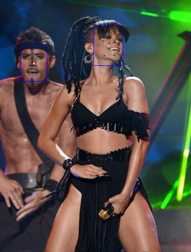
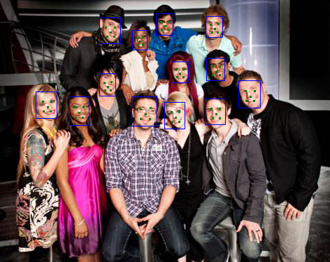

# 测试

本篇是 Build Your Own Face Detection Model 的第七节。

这一节，我们对训练的模型进行测试。这里的测试，并不是跑出一些准确率的指标，而是拿一些网络图片，来直观地感受模型的性能。

### 1 >> 解码流水线

热力图`hm`中，每个点都是`0-1`之间，可以表示概率。在 Centernet 中，采用 3x3 maxpooling 来替代常规的`nms`。这样，取得所有这些点之后，通过一个置信度阈值来过滤掉FP，得到所有的中心点后，根据中心点的坐标依次解码出其他的值。

创建`api.py`文件，导入依赖：

```py
import os
import os.path as osp

import torch
import numpy as np
from PIL import Image

# local imports
from config import Config as cfg
from models.mnet import get_mobile_net
from utils import VisionKit
```

接着创建一个跟训练时一样的网络，并导入权重

```py
def load_model():
    net = get_mobile_net(10, {'hm':1, 'wh':2, 'lm':10, 'off':2}, head_conv=24)
    path = osp.join(cfg.checkpoints, cfg.restore_model)
    weights = torch.load(path, map_location=cfg.device)
    net.load_state_dict(weights)
    net.eval()
    return net

net = load_model()
```

图像预处理，放缩到适合网络的尺寸。这次，我把后面三个参数都合并在一个列表里。

```py
def preprocess(im):
    new_im, _, _, *params = VisionKit.letterbox(im, cfg.insize)
    return new_im, params
```

检测，并返回第一个检测结果。

```py
def detect(im):
    data = cfg.test_transforms(im)
    data = data[None, ...]
    with torch.no_grad():
        out = net(data)
    return out[0]
```

现在，我们开始从结果中解码出人脸信息。

```py
def decode(out):
    hm = out['hm']
    wh = out['wh']
    off = out['off']
    lm = out['lm']
    hm = VisionKit.nms(hm, kernel=3)
    hm.squeeze_()
    off.squeeze_()
    wh.squeeze_()
    lm.squeeze_()
```

首先从结果中取出对应的模型输出，对`hm`进行`nms`。函数定义在`utils.py`里，其来源于 Princeton 的[CornerNet](https://github.com/princeton-vl/CornerNet)。

```py
class VisionKit:
    # 省略
    @staticmethod
    def nms(heat, kernel):
        padding = (kernel - 1) // 2
        hmax = nn.functional.max_pool2d(heat, kernel, stride=1, padding=padding)
        keep = (hmax == heat).float()
        return heat * keep
```

经过`nms`之后，用阈值过滤掉那些置信度低的值。

```py
class Config:
    # 省略...
    # inference
    threshold = 0.4
```

接着写`decode`

```py
def decode(out):
    # 省略
    hm = hm.numpy()
    hm[hm < cfg.threshold] = 0
    xs, ys = np.nonzero(hm)
```

现在，我们拿到了所有点的坐标了。接下来，我们用一个`for`循环来逐点解码人脸信息。

```py
def decode(out):
    # 省略
    bboxes = []
    landmarks = []
    for x, y in zip(xs, ys):
        ow = off[0][x, y]
        oh = off[1][x, y]
        cx = (ow + y) * 4
        cy = (oh + x) * 4
```

首先，解析出中心点的真实位置`cx`，`cy`。这里要注意，`numpy`的`x`指的是第`x`行，从图像来说是指`y`坐标，反之亦然。

然后，我们从中心点解析出人脸框

```py
def decode(out):
    # 省略
    for x, y in zip(xs, ys):
        # 省略
        w = wh[0][x, y]
        h = wh[1][x, y]
        width = np.exp(w) * 4
        height = np.exp(h) * 4

        left = cx - width / 2
        top = cy - height / 2
        right = cx + width / 2
        bottom = cy + height / 2
        bboxes.append([left, top, right, bottom])
```

然后是人脸关键点，并返回结果，这样，`decode`就完成了。

```py
def decode(out):
    # 省略
    for x, y in zip(xs, ys):
        # 省略
        lms = []
        for i in range(0, 10, 2):
            lm_x = lm[i][x, y]
            lm_y = lm[i+1][x, y]
            lm_x = lm_x * width + left 
            lm_y = lm_y * height + top 
            lms += [lm_x, lm_y]
        landmarks.append(lms)

    return bboxes, landmarks
```

但是，现在的结果还是经过预处理`letterbox`放缩过的，我们需要把它们还原成原图片的坐标。在`utils.py`中添加以下代码

```py
class VisionKit:

    @staticmethod
    def letterbox_inverse(scale, offset_x, offset_y, bboxes=None, landmarks=None, skip=3):
        if bboxes is not None:
            bboxes = np.array(bboxes)
            bboxes[:, 0::2] -= offset_x
            bboxes[:, 1::2] -= offset_y
            bboxes /= scale
        if landmarks is not None:
            landmarks = np.array(landmarks)
            landmarks[:, 0::skip] -= offset_x
            landmarks[:, 1::skip] -= offset_y
            landmarks /= scale
        return bboxes, landmarks
```

现在，我们可以很方便地把坐标转换回去了。在`api.py`中写入：

```py
def postprocess(bboxes, landmarks, params):
    bboxes, landmarks = VisionKit.letterbox_inverse(*params, bboxes, landmarks, skip=2)
    return bboxes, landmarks
```

至此，整个解码流水线就走完了！

为了查看效果，我们写个可视化功能。在`utils.py`中

```py
class VisionKit:

    @staticmethod
    def visualize(im, bboxes=[], landmarks=[], skip=3):
        im = im.copy()
        handle = ImageDraw.Draw(im)
        for bbox in bboxes:
            # draw bbox
            left, top, right, bottom = map(int, bbox)
            handle.rectangle([left, top, right, bottom], outline=(0,0,255), width=1)
            # draw center Point
            width = right - left
            height = bottom - top
            center_x = left + width // 2
            center_y = top + height // 2
            handle.ellipse([center_x-1, center_y-1, center_x+1, center_y+1], width=1)

        for landmark in landmarks:
            for i in range(0, len(landmark), skip):
                x, y = int(landmark[i]), int(landmark[i+1])
                handle.ellipse([x-1, y-1, x+1, y+1], fill=(0,127,0), width=1)
        im.show()
        return im
```

然后，在`api.py`中简单封装一下：

```py
def visualize(im, bboxes, landmarks):
    return VisionKit.visualize(im, bboxes, landmarks, skip=2)
```

现在，连通所有的函数，我们可以测试模型的直观效果。

```py
if __name__ == '__main__':
    impath = 'samples/a.jpg'
    im = Image.open(impath)
    new_im, params = preprocess(im)
    pred = detect(new_im)
    bboxes, landmarks = decode(pred)
    bboxes, landmarks = postprocess(bboxes, landmarks, params)
    visualize(im, bboxes, landmarks)
```





嗯？不管是框还是关键点，都有些误差呢！不过，我们的模型可没有 tricks!

### 2 >> 总结

我们快速走完了 CenterFace 从解析标签文件-数据预处理-标签生成-网络架构-损失函数-训练-测试的整个流水线，希望这可以作为一个入门 centernet/centerface 式的检测模型的实用指南。为了让实现变得简单，这个实现有很多的妥协之处：

+ 输入为 416x416，而不是 800x800
+ 固定的 sigma
+ 无剪切，翻转等数据增强
+ 简单的 backbone
+ 用 MSE 代替了带 focal loss 的交叉熵损失

你可以进行更多的试验来改进，希望这一份 base 代码带给你好运！

### 3 >>

愿凡有所得，皆能自利利他。