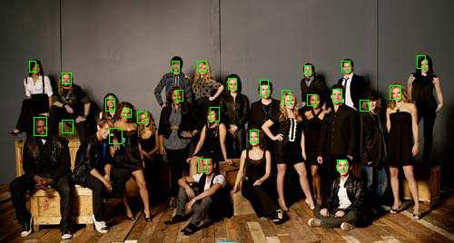

# 人脸检测原理

本篇是 Build Your Own Face Detection Model 的第一节。在这一节中，我们将学习人脸检测的基本原理。


### 1 >> 预选框模型

以预选框作为核心技术的检测模型一直是主流。虽然本教程的目标是实现一个基于关键点的检测模型（CenterFace），但对预选框模型基本原理的理解，还是大有裨益的。

预选框的基本流程如下：

1、在特征图上，生成大小不同、宽高比各异的 10k~100k 左右的预选框。</br>
2、计算每一个预选框的类别分数，并对预选框进行修正。</br>
3、基于类别分数，过滤掉那些分数低的框，这一步通常过滤了 10k~100k 个框，只剩下数目极少的框。</br>
4、对于多个靠得太近，框住了同一个物体的框，进行 NMS 去重。

由于需要生成和去除大量预选框，这种模型速度很慢；由于一张图片通常只有几个物体，所以这种方法效率低下；为了避免漏检，框通常很密集。所以需要 NMS 去重。预选框这些先天的缺陷是显而易见的。

关于预选框的讨论在知乎上有很多，基本上等同 anchor-based 和 anchor-free 的讨论。

### 2 >> 基于关键点的检测模型

基于关键点的检测模型，多见于人体姿态估计（Pose Estimation）。在 CenterNet 中，作者将物体的中心点作为其关键点，通过热力图来预测关键点，达到检测的目的。其基本流程如下：

1、生成输入图片的热力图，其值在 0～1 之间，且物体的中心点处值最大。<br/>
2、生成宽特征图和高特征图。<br/>
3、使用阈值选出热力图值大于阈值的点，取得这些点在特征图上对应的宽与高。

简而言之，以点代物。CenterFace 完全依循 CenterNet 的思路。

### 3 >> 标签生成

#### 3.1 中心点热力图

1、计算 Bounding Box(bbox) 的中心点的坐标。<br/>
2、以中心点坐标为中心，将热力值向周围扩散出去。<br/>

如下图所示（来自人体姿态估计 `openpose`），热力图以鼻子为中心点向外扩散。


具体而言，扩散公式：

$$ \Large H(x,y) = e^{-\frac{(x - x_k)^2 + (y - y_k)^2}{2\sigma^2}} $$

$x_k, y_k$表示中心点的坐标，$\sigma$控制扩散范围。

#### 3.2 偏移

当原 bbox 比较小时，放缩带来的误差就会很明显。所以对于每个中心点，预测一个偏移量来纠正。

```py
downscale = 4
offset_x = x / downscale - x // downscale
```



#### 3.3 宽高

CenterNet 中直接预测物体的宽与高，而在 CenterFace 中，对宽高取 `log`。

#### 3.4 人脸关键点

这部分是 CenterFace 中独有的，每个关键点都关于中心点计算一个比例值。

```py
lm_x = (lm_x - center_x) / width
lm_y = (lm_y - center_y) / height
```
### 4 >> 网络结构

关键点检测模型的骨干通常是 encoder-decoder 结构，如 Unet 和 Hourglass 等等。根据我们的检测模型，网络的 head 包括以下四个分支

+ 中心点热图 `[ 1, H, W]`
+ 中心点偏移 `[ 2, H, W]`
+ 宽高特征图 `[ 2, H, W]`
+ 人脸关键点 `[10, H, W]`

### 5 >> 损失函数

中心点热图损失，CenterNet 和 CenterFace 都沿用了 CornerNet 的损失，即带`focal loss`的交叉熵损失。为了简单起见，我采用的是 `openpose` 所使用的 `L2` 损失。

偏移量、宽高、人脸关键点的损失，都使用了 `SmoothL1Loss`。

### 6 >> 小结

希望这一节内容，可以让你捕捉到基于关键点的检测模型的精粹。在后续的文章中，我将会把这些想法转化成具体的实现。

### 7 >>

愿凡有所得，皆能自利利他。